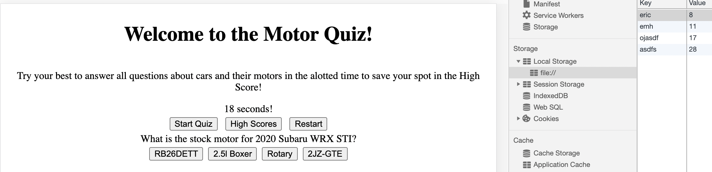

# JavaScript-Quiz

## Description
After clicking the link below you will be brought to a quiz testing you on your motor knowledge for 5 cars.  Upon clicking the start button, the timer will start counting down.  Final score is calculated by the time remaining on answering the last question.  Each missed question will reduce your final score by 10 seconds! Once entering your initials into the prompt window you can hit restart to try again and raise your high score!

## Acceptance Criteria

```
GIVEN I am taking a code quiz
WHEN I click the start button
THEN a timer starts and I am presented with a question
WHEN I answer a question
THEN I am presented with another question
WHEN I answer a question incorrectly
THEN time is subtracted from the clock
WHEN all questions are answered or the timer reaches 0
THEN the game is over
WHEN the game is over
THEN I can save my initials and my score
```

## Links to GitHub Repo and Deployed Application
[GitHub Repo](https://github.com/HurleySquared/javascript-quiz)
[Deployed Application](https://hurleysquared.github.io/javascript-quiz/)
## Screenshot of Quiz
